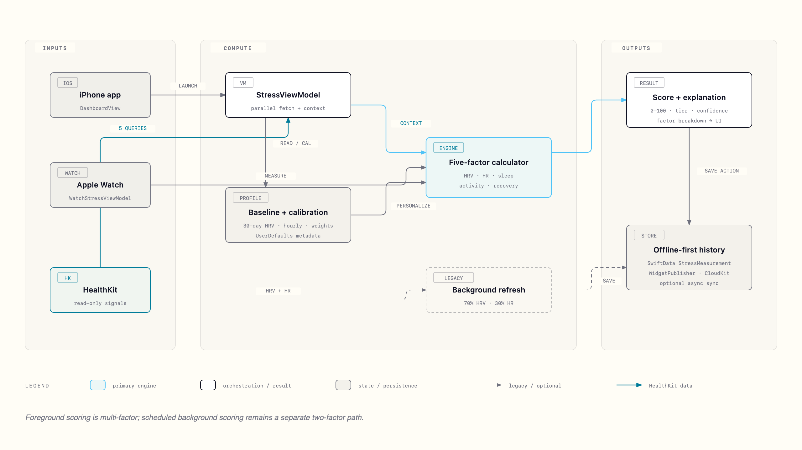

# StressMonitor

**AI-powered stress monitoring for iOS and watchOS.**

  

---

## Overview

StressMonitor measures stress levels using Heart Rate Variability (HRV) and heart rate from HealthKit, combined with sleep, activity, and recovery data. An AI coaching chat provides personalized wellness guidance. Data stays private — local SwiftData storage with optional end-to-end encrypted CloudKit sync.

## Features

- **Multi-Factor Stress Score** — HRV, heart rate, sleep, activity, and recovery weighted into a single 0–100 score
- **AI Stress Coach** — LLM-powered chat with streaming responses, wellness guardrails, and context-aware suggestions
- **Stress Buddy** — Character system with 5 mood states reflecting current stress level
- **Breathing Exercises** — Guided box breathing with biofeedback and animated visual circle
- **Mini Walk** — Walking exercise with circular timer for immediate stress relief
- **Morning Readiness** — HRV trend analysis for daily readiness assessment
- **Historical Tracking** — Timeline, trend charts, and distribution analytics
- **Apple Watch** — Standalone watchOS app with live WidgetKit complications
- **Home Screen Widgets** — Small, medium, and large widgets for at-a-glance monitoring
- **IAP Premium** — Subscription paywall with StoreKit integration
- **Journal** — Mood and stress notes alongside measurements
- **Data Export** — CSV and JSON export with date filtering
- **Privacy-First** — Local-first storage, HealthKit read-only, no third-party analytics

## Quick Start

### Requirements

| Component | Minimum |
|-----------|---------|
| Xcode | 15.0+ |
| iOS | 17.0+ |
| watchOS | 10.0+ |
| Device | iPhone 12, Apple Watch Series 6 |

### Build

```bash
git clone https://github.com/your-org/ios-stress-app.git
cd ios-stress-app/StressMonitor
open StressMonitor.xcodeproj
# Build and run (Cmd+R)
```

### Demo Mode

For testing without real HealthKit data:

1. Edit Scheme → Run → Arguments → add `-demo-mode`
2. Build and run on simulator

Demo mode generates dynamic HRV/HR data cycling through all stress levels with 30s scenario transitions.

## How It Works

### Stress Algorithm

Multi-factor calculator combines 5 physiological signals:

```
Factor Scores → Weighted Sum → Stress Level (0-100)

Default Weights:
  HRV: 70% | Heart Rate: 30% | Sleep/Activity/Recovery: supplementary
```

Each factor computes a normalized deviation from personal baseline, then contributes to the weighted score. Confidence adjusts for data quality (low HRV, extreme HR, missing factors).

### Stress Categories

| Level | Range | Color | Icon |
|-------|-------|-------|------|
| Relaxed | 0–25 | Green | 😊 |
| Mild | 25–50 | Blue | 😐 |
| Moderate | 50–75 | Yellow | 〰️ |
| High | 75–100 | Orange | ⚠️ |

## Project Structure

```
StressMonitor/
├── StressMonitor/                          # iOS App (~225 files, ~28K LOC)
│   ├── Models/                             # Data models (18+ files)
│   ├── Services/
│   │   ├── HealthKit/                      # Health data fetching
│   │   ├── Algorithm/                      # Multi-factor stress calculation
│   │   ├── Repository/                     # SwiftData persistence
│   │   ├── CloudKit/                       # iCloud sync
│   │   ├── LLM/                            # Cloud LLM (Supabase Edge Functions)
│   │   ├── StoreKit/                       # IAP Premium subscriptions
│   │   ├── Background/                     # Notifications & tasks
│   │   ├── Connectivity/                   # Watch connectivity
│   │   └── Sync/                           # Data synchronization
│   ├── ViewModels/                         # @Observable state
│   ├── Views/
│   │   ├── Dashboard/                      # Main stress display + AI cards
│   │   ├── Chat/                           # AI coaching interface
│   │   ├── Breathing/                      # Guided breathing exercises
│   │   ├── MiniWalk/                       # Walking exercise with timer
│   │   ├── Premium/                        # IAP subscription screen
│   │   ├── Journal/                        # Mood & stress notes
│   │   ├── History/                        # Measurement timeline
│   │   ├── Trends/                         # Analytics charts
│   │   ├── Settings/                       # App settings & data management
│   │   └── Onboarding/                     # First-launch flow
│   └── Theme/                              # Design system (AppIconSystem, CharacterAssetCatalog, MoodFaceAssetCatalog, colors, typography)
├── StressMonitorWatch Watch App/           # watchOS App (44 files, ~3.2K LOC)
│   ├── Services/                           # Watch HealthKit + CloudKit
│   ├── Models/                             # Shared data models
│   ├── ViewModels/                         # Watch app state
│   ├── Views/                              # Compact watch UI
│   └── Complications/                      # WidgetKit complications
├── StressMonitorWidget/                    # Home Screen Widgets (7 files, ~1.4K LOC)
└── StressMonitorTests/                     # Unit & UI tests (5 files)
```

## Architecture

MVVM with protocol-based dependency injection:

[](docs/diagrams/stress-calculation-architecture.html)

```
Views (SwiftUI)
    ↓
ViewModels (@Observable)
    ↓
Services (Protocol-based)
    ↓
Data Layer (SwiftData + CloudKit)
```

## Tech Stack

| Layer | Technology |
|-------|-----------|
| UI | SwiftUI |
| State | @Observable (iOS 17+) |
| Persistence | SwiftData |
| Cloud Sync | CloudKit (E2E encrypted) |
| Health Data | HealthKit (read-only) |
| Widgets | WidgetKit |
| Networking | Moya + Alamofire |
| AI Chat | SupabaseLLMService (production, SSE streaming via Edge Functions) |
| Charts | SwiftUICharts |

## Dependencies

Swift Package Manager (8 packages):

| Package | Purpose |
|---------|---------|
| Moya | Network abstraction for LLM API |
| Alamofire | HTTP networking |
| Kingfisher | Image loading/caching |
| SwiftUICharts | Custom chart views |
| ReactiveSwift | Reactive primitives |
| RxSwift | Reactive extensions |
| Chat | Chat UI components |
| Giphy iOS SDK | GIF support |
| MediaPicker | Media selection |
| ActivityIndicatorView | Loading indicators |
| AnchoredPopup | Popup overlays |
| AnimatedTabBar | Animated tab bar |
| LibWebP | WebP image support |

## Capabilities

- **HealthKit** — Read HRV and Heart Rate
- **iCloud (CloudKit)** — Data synchronization
- **App Groups** — Widget data sharing
- **Background Modes** — App Refresh

## Privacy

- Local SwiftData storage (encrypted at rest by iOS)
- CloudKit end-to-end encrypted sync
- HealthKit read-only (no writes)
- No analytics, no advertising IDs, no tracking

## Documentation

Comprehensive docs in `docs/`:

| Document | Description |
|----------|-------------|
| [Project Overview & PDR](docs/project-overview-pdr.md) | Product requirements |
| [Codebase Summary](docs/codebase-summary.md) | File structure |
| [Project Roadmap](docs/project-roadmap.md) | Milestones & progress |
| [Code Standards](docs/code-standards.md) | Swift conventions |
| [System Architecture](docs/system-architecture.md) | MVVM architecture |
| [Deployment Guide](docs/deployment-guide.md) | Build & release |
| [Design Guidelines](docs/design-guidelines.md) | UI/UX design system |

## Development

```bash
# Build iOS app
xcodebuild -scheme StressMonitor \
    -destination 'platform=iOS Simulator,name=iPhone 15'

# Build watchOS app
xcodebuild -scheme "StressMonitorWatch Watch App" \
    -destination 'platform=watchOS Simulator,name=Apple Watch Series 9'

# Run tests
xcodebuild test -scheme StressMonitor \
    -destination 'platform=iOS Simulator,name=iPhone 15'
```

## Deployment

1. Archive in Xcode (Product → Archive)
2. Upload to App Store Connect
3. Configure TestFlight or submit for review
4. See [deployment guide](docs/deployment-guide.md) for details

---

**Created by:** Phuong Doan
**Version:** 1.0 Pre-Ship RC1
**Platform:** iOS 17+ / watchOS 10+
**Last Updated:** July 19, 2026
**Ship Status:** B1 ✅ (Jun 7), B2 ✅ (Jun 12), B3 🚫 (test suite pending - estimated July 2026 resolution)
