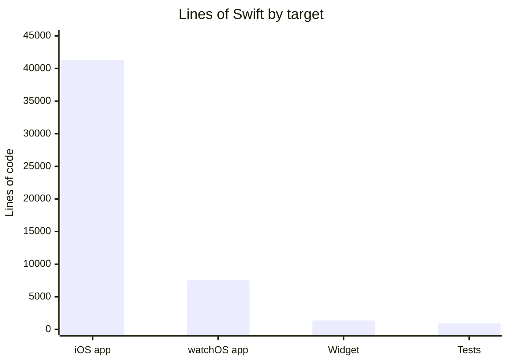
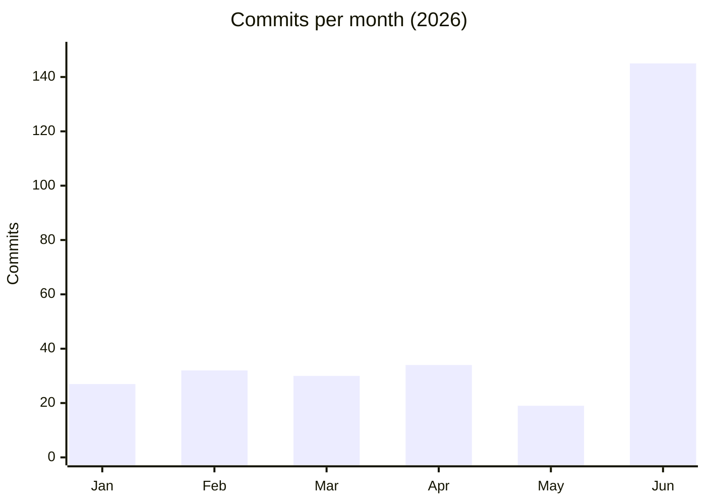

# By the numbers

Data collected on 2026-06-29. Figures are derived from the default branch (`main`) at commit `92a40a2`.

## Size

The codebase is ~51,000 lines of Swift across 406 source files. Three Xcode targets and one test bundle. The watchOS target grew from ~4,400 to ~7,500 lines after the Jun 28 feature-parity expansion (Bio Age, habits, mood, workout HR zones, cycle tracking, seasonal themes).

| Metric | Count |
| --- | --- |
| Swift source files | 406 |
| Total lines of Swift | ~51,100 |
| Unit test files | 5 (in `StressMonitorTests/`) |
| Test lines | 912 |
| Test-to-code ratio | ~1.8% (test suite is sparse, called out as B3 blocker) |

## Activity

The repository has 287 commits since the initial commit on 2026-01-18.

June 2026 is the busiest month by a wide margin (145 commits), driven by the full UI redesign to the Ripple design system, the icon system migration, the character SVG asset migration, and the watchOS feature-parity expansion (Bio Age, habits, mood, workout HR zones, cycle tracking, seasonal themes).

### Churn hotspots (last 90 days)

| File | Changes |
| --- | --- |
| `StressMonitor/StressMonitor/Views/DashboardView.swift` | 15 |
| `StressMonitor/StressMonitor/Views/Settings/SettingsView.swift` | 14 |
| `StressMonitor/StressMonitor/Views/Trends/TrendsView.swift` | 11 |
| `StressMonitor/StressMonitor/Views/Action/ActionView.swift` | 10 |
| `StressMonitor/StressMonitorWidget/Views/MediumWidgetView.swift` | 8 |
| `StressMonitor/StressMonitor/ViewModels/ChatViewModel.swift` | 8 |
| `StressMonitor/StressMonitorWidget/Views/LargeWidgetView.swift` | 7 |
| `StressMonitor/StressMonitor/Views/MainTabView.swift` | 7 |
| `StressMonitor/StressMonitor/Views/Characters/CharacterCollectionView.swift` | 7 |
| `StressMonitor/StressMonitor/ViewModels/StressViewModel.swift` | 7 |
| `StressMonitor/StressMonitor/Views/Onboarding/OnboardingSuccessView.swift` | 6 |
| `StressMonitor/StressMonitor/Views/Chat/ChatBottomSheetView.swift` | 6 |

The dashboard, settings, and trends views are the most churned files, reflecting the June redesign pass.

## Bot-attributed commits

Zero commits in the default branch history carry a bot co-author signature (`Co-authored-by: factory-droid[bot]`, `dependabot[bot]`, `github-actions[bot]`, `copilot[bot]`). This is a lower bound on AI-assisted work; inline AI tools like Copilot leave no trace in git history.

## Complexity

### Largest source files

| File | Lines |
| --- | --- |
| `StressMonitor/Views/StressHistoryView.swift` (legacy) | 840 |
| `StressMonitor/StressMonitor/Components/Character/RippleCharacterView.swift` | 573 |
| `StressMonitor/StressMonitorWatch Watch App/Theme/StressCharacter.swift` | 521 |
| `StressMonitor/StressMonitor/ViewModels/StressViewModel.swift` | 571 |
| `StressMonitor/StressMonitor/Components/Character/BlossomCharacterView.swift` | 552 |
| `StressMonitor/StressMonitor/Views/Trends/TrendsViewModel.swift` | 550 |
| `StressMonitor/StressMonitor/Components/Character/EmberCharacterView.swift` | 539 |
| `StressMonitor/StressMonitor/Services/DataManagement/CloudKitResetService.swift` | 537 |
| `StressMonitor/StressMonitor/Components/Character/LumiCharacterView.swift` | 533 |
| `StressMonitor/StressMonitor/Components/Character/ZephyrCharacterView.swift` | 532 |

The five `*CharacterView.swift` files in `Components/Character/` are procedural SwiftUI drawing code that was replaced by exported SVG assets in commit `b99b1ca`. The watch-side `StressCharacter.swift` grew to 521 lines after the Jun 28 redesign added inline SVG illustrations for the five elemental companions. The largest actively-used iOS source files are `StressViewModel.swift`, `TrendsViewModel.swift`, and `CloudKitResetService.swift`.

### Unique contributors

Six distinct author names appear in git history on the default branch, all aliases of the same developer (`ddx-pro17`, `Phuong Doan`, `phuongddx`, `PhuongDoan`, `phuongdoan-muji-aavn`, `phuongdoanx`). Bus factor is effectively one.
