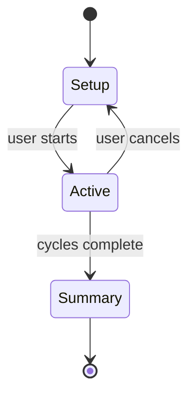

# Breathing exercises

Guided box-breathing sessions with an animated visual circle and biofeedback. Lives under the Action tab and is also reachable from the dashboard quick-action grid and the Apple Watch app.

## Flow

## Views

| View | File | Purpose |
| --- | --- | --- |
| `BreathingExerciseView` | `StressMonitor/StressMonitor/Views/Breathing/BreathingExerciseView.swift` | Setup screen: pattern picker, duration |
| `BreathingSessionView` | `StressMonitor/StressMonitor/Views/Breathing/BreathingSessionView.swift` | Active session: animated circle, phase label |
| `BreathingSummaryView` | `StressMonitor/StressMonitor/Views/Breathing/BreathingSummaryView.swift` | Post-session summary with HRV before/after |
| `BreathingCircle` | `StressMonitor/StressMonitor/Views/Breathing/Components/BreathingCircle.swift` | The scaling animation circle |
| `RippleBreathingView` | `StressMonitor/StressMonitor/Views/Breathing/Components/RippleBreathingView.swift` | Ripple character integrated into the breathing animation |
| `PhaseLabel` | `StressMonitor/StressMonitor/Views/Breathing/Components/PhaseLabel.swift` | Inhale / hold / exhale / hold label |
| `BeforeAfterHRVChart` | `StressMonitor/StressMonitor/Views/Breathing/Components/BeforeAfterHRVChart.swift` | HRV comparison chart on summary |

## View model

`BreathingViewModel` (at `StressMonitor/StressMonitor/Views/Breathing/BreathingViewModel.swift`) drives the session lifecycle. It owns:

- Selected pattern (box, relaxed, energizing).
- Cycle count and elapsed time.
- Current phase (`inhale`, `holdIn`, `exhale`, `holdOut`) and phase duration.
- Pre- and post-session HRV snapshots for the before/after chart.
- Session completion callback that records a session toward `CharacterUnlock.sessionsCompleted`.

Advanced patterns are gated behind premium. The gating view calls `paywall.present(reason: .breathingAdvanced)`.

## Watch integration

`WatchBreatheView` (at `StressMonitor/StressMonitorWatch Watch App/Views/WatchBreatheView.swift`) runs a standalone guided session on Apple Watch with a compact breathing circle. Sessions completed on the watch sync back through `WatchConnectivityManager` and increment the phone-side character session counter.

## Entry points for modification

- **Add a new breathing pattern**: add a case to the pattern enum in `BreathingViewModel`, define its phase durations, and surface it in `BreathingExerciseView`.
- **Change the circle animation**: edit `BreathingCircle.swift` or `RippleBreathingView.swift`.
- **Tune the summary metrics**: edit `BreathingSummaryView.swift` and the before/after HRV fetch logic in `BreathingViewModel`.
