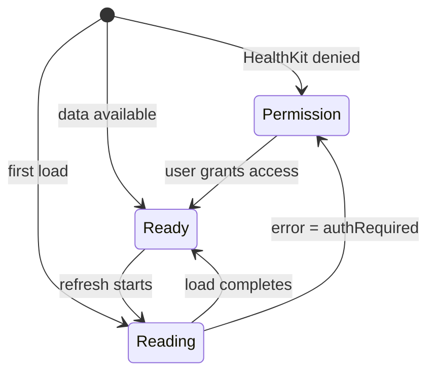

# Dashboard

The Home tab. Renders the current stress score, vitals row, AI insight cards, mood check-in, and quick-action grid. The dashboard is the default landing surface and owns the auto-refresh loop that keeps stress data current.

## What the user sees

| Region | Component | Source |
| --- | --- | --- |
| Hero | Stress score, category, character mood | `StressHeroCard.swift` |
| Vitals | HRV / HR / respiratory rate triplet | `VitalsTriplet.swift`, `HealthDataSection.swift` |
| Mood check-in | Five-level mood picker | `MoodCheckInView.swift` |
| AI insight | Generated insight from `InsightGeneratorService` | `AIInsightCard.swift`, `DashboardInsightCard.swift` |
| AI chat entry | Chat shortcut | `AIChatCard.swift` |
| Stress sources | Per-factor breakdown | `StressSourcesCard.swift` |
| 7-day chart | Mini trend | `StressChart7d.swift`, `StressOverTimeChart.swift` |
| Bio age | Biological age estimate (premium) | `BioAgeCardView.swift` |
| Premium banner | Paywall entry | `PremiumBanner.swift` |
| Quick actions | Breathing, walk, etc. | `QuickActionGrid.swift` |
| Weekly insight | Pattern summary | `WeeklyInsightCard.swift` |

## State machine

`DashboardView` chooses one of three top-level states based on `StressViewModel`:

- `permissionStateView` shows `PermissionCardView` when `viewModel.isPermissionRequired`.
- `readingStateView` shows skeleton placeholders while the first load is in flight.
- `readyStateView` renders the full dashboard.

## View model

`StressViewModel` (at `StressMonitor/StressMonitor/ViewModels/StressViewModel.swift`, 573 lines) is the largest view model in the app. It owns:

- Current stress result, baseline, historical data, live HR.
- Dashboard vitals state: respiratory rate, mood, exercise minutes, sleep hours, daylight minutes.
- Bio age state (`bioAgeResult`, `userAge`, `hasSufficientBioAgeData`).
- Permission state (`isPermissionRequired`, `isRequestingAccess`).
- Auto-refresh loop (`lastRefreshTime`, `refreshInterval = 60s`, observer query).
- Heart rate observation task and demo mode refresh task (DEBUG).

### Auto-refresh

On view appear, `DashboardView.task` calls `loadInitialData()` and `viewModel.startAutoRefresh()`. Auto-refresh debounces to one calcuation per minute, re-runs the full HealthKit fetch and stress calculation pipeline, persists the result, and updates the widget snapshot. A separate `HKObserverQuery` (through `observeHeartRateUpdates()`) drives live HR updates more frequently.

### Demo mode periodic refresh

In DEBUG builds with `-demo-mode`, a background `Task` cycles the simulated scenario every 30 seconds and pushes a new `StressResult` into `currentStress`. The UI reacts as if a real measurement had arrived.

## Health data row

`HealthDataSection` and `HealthDataRow` render behavioral metrics (exercise minutes, sleep hours, daylight minutes) sourced from `StressViewModel.todayExerciseMinutes`, `todaySleepHours`, `todayDaylightMinutes`. These come from HealthKit queries in `HealthKitManager+ActivityFetch.swift` and `HealthKitManager+RecoveryFetch.swift`.

## Entry points for modification

- **Add a new dashboard card**: create a component under `StressMonitor/StressMonitor/Views/Dashboard/Components/`, then add it to the `readyStateView` scroll stack in `DashboardView.swift`.
- **Change refresh cadence**: edit `refreshInterval` in `StressViewModel`.
- **Change hero layout**: edit `StressHeroCard.swift` (the main hero card is at `StressMonitor/StressMonitor/Views/Dashboard/Components/StressHeroCard.swift`).
