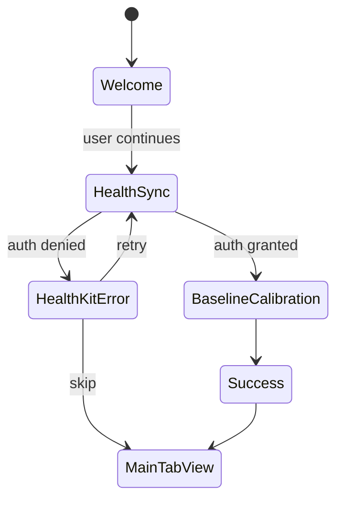

# Onboarding

First-launch flow that gates the user before they reach `MainTabView`. Handles HealthKit authorization, baseline calibration, and a welcome/success sequence. The root view mounted by `StressMonitorApp`.

## Views

| View | File | Purpose |
| --- | --- | --- |
| `OnboardingContainerView` | `StressMonitor/StressMonitor/Views/Onboarding/OnboardingContainerView.swift` | Step container, decides next view based on health state |
| `OnboardingWelcomeView` | `StressMonitor/StressMonitor/Views/Onboarding/OnboardingWelcomeView.swift` | Welcome screen, value prop |
| `OnboardingHealthSyncView` | `StressMonitor/StressMonitor/Views/Onboarding/OnboardingHealthSyncView.swift` | HealthKit permission request |
| `OnboardingBaselineCalibrationView` | `StressMonitor/StressMonitor/Views/Onboarding/OnboardingBaselineCalibrationView.swift` | Initial baseline calibration |
| `OnboardingSuccessView` | `StressMonitor/StressMonitor/Views/Onboarding/OnboardingSuccessView.swift` | Success screen, character reveal |
| `HealthKitErrorView` | `StressMonitor/StressMonitor/Views/Onboarding/HealthKitErrorView.swift` | Error recovery when auth denied |

Each step has a paired view model (for example, `OnboardingWelcomeViewModel`) that isolates state and makes the steps testable.

## Flow

`OnboardingContainerView` branches based on `OnboardingHealthSyncViewModel`'s health state. When HealthKit is unavailable or denied, it routes through `HealthKitErrorView` which offers retry or skip (skip lands the user on `MainTabView` with a permission card on the dashboard).

## Baseline calibration

`OnboardingBaselineCalibrationView` runs the first `BaselineCalculator` pass over whatever historical HRV data is available. If the user has prior Apple Health data, the baseline is derived from it. Otherwise the app falls back to population defaults and refines over the first few days of use.

## Entry points for modification

- **Add a new step**: insert it into `OnboardingContainerView`'s branch and create the view/view-model pair.
- **Change the skip behavior**: edit `HealthKitErrorView` and the skip handler in `OnboardingContainerView`.
