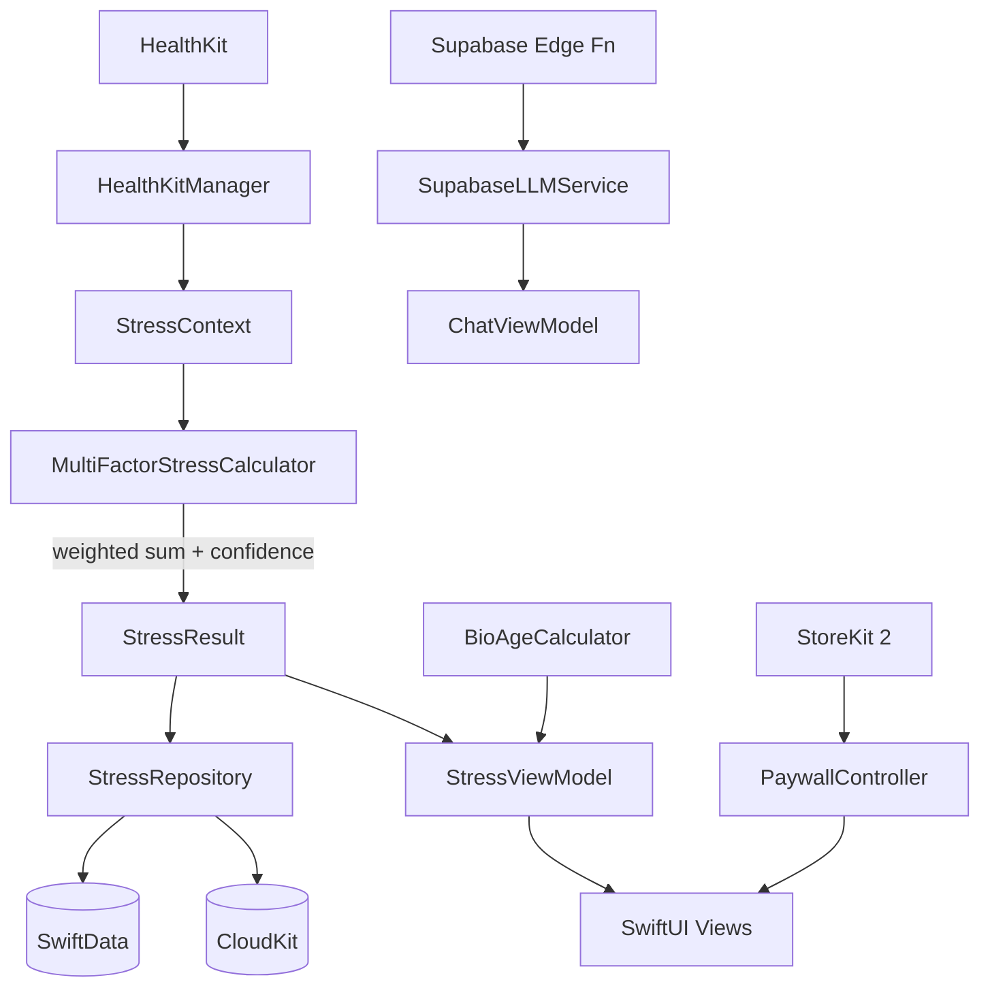
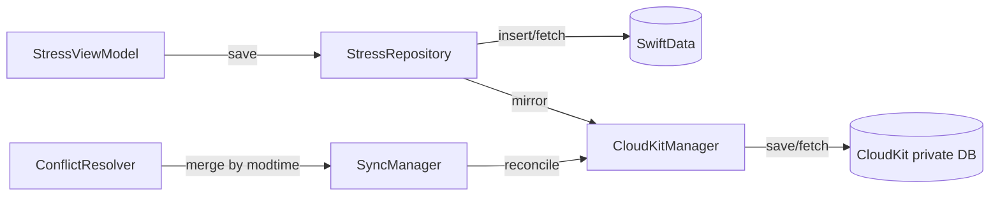

# Architecture

StressMonitor uses MVVM with protocol-based dependency injection, SwiftUI for all UI, SwiftData for local persistence, and CloudKit for optional encrypted sync. The stress algorithm is the core domain: five `StressFactor` implementations feed a weighted `MultiFactorStressCalculator` that produces a normalized `StressResult` with per-factor breakdown and confidence.

## Layers

| Layer | Responsibility | Key files |
| --- | --- | --- |
| Views | SwiftUI screens, components, design system | `StressMonitor/StressMonitor/Views/` |
| ViewModels | `@Observable` state containers, async orchestration | `StressMonitor/StressMonitor/ViewModels/` |
| Services | Domain logic: algorithm, HealthKit, LLM, StoreKit, sync | `StressMonitor/StressMonitor/Services/` |
| Models | SwiftData `@Model` classes and plain structs | `StressMonitor/StressMonitor/Models/` |
| Theme | Design tokens, colors, fonts, asset catalogs | `StressMonitor/StressMonitor/Theme/` |

## App entry and navigation

`StressMonitorApp.swift` (at `StressMonitor/StressMonitor/StressMonitorApp.swift`) is the `@main` entry point. It constructs the SwiftData `ModelContainer` with a versioned schema and lightweight migration plan (V1 ships `StressMeasurement` and `CharacterUnlock`; V2 adds `Habit`), seeds default character unlocks, and injects two app-wide singletons into the environment: `AppRouter` (tab + per-tab `NavigationPath` state) and `PaywallController` (full-screen paywall presentation).

The root view is `OnboardingContainerView`, which gates first-launch users through a health-sync and baseline-calibration flow before handing off to `MainTabView`. `MainTabView` hosts four `NavigationStack`s (Home, Action, Trends, Settings), one per tab, each bound to a path on `AppRouter`.

## Stress algorithm pipeline

1. `HealthKitManager` fetches HRV (SDNN), heart rate, sleep, activity, and recovery samples via async wrapper methods over `HKSampleQuery`.
2. `StressViewModel` packs those raw values plus a `PersonalBaseline` into a `StressContext`.
3. `MultiFactorStressCalculator.calculateMultiFactorStress(context:)` iterates registered `StressFactor` implementations, each returning an optional `FactorResult` (0-1 normalized score plus confidence). Missing factors are skipped and their weights redistributed.
4. The composite score is a weighted sum of available factor values normalized against the sum of available weights, scaled to 0-100.
5. `StressResult.category` bins the level into five tiers (relaxed, mild, moderate, high, severe) that drive color, icon, and character mood.

See [Stress algorithm](../systems/stress-algorithm.md) for factor weights and the fallback calculator.

## Data persistence

`StressMeasurement` is the central `@Model` persisted by SwiftData. Each record carries the composite stress level, raw biometric inputs, per-factor component values (for the multi-factor breakdown), and CloudKit sync metadata (`isSynced`, `cloudKitRecordName`, `deviceID`, `cloudKitModTime`). `StressRepository` is the single write path and delegates CloudKit mirroring to `CloudKitManager`.

## Sync

CloudKit sync runs through three cooperating types: `CloudKitManager` wraps `CKDatabase` save/fetch operations, `SyncManager` orchestrates push/pull cycles and delegates conflicts to `ConflictResolver`, and `ConflictResolver` merges by `cloudKitModTime` with last-writer-wins semantics per record. See [CloudKit sync](../systems/cloudkit-sync.md).

## AI chat

`SupabaseLLMService` posts chat messages to a Supabase Edge Function `/chat` endpoint and streams Server-Sent Events tokens through `SSEParser`. The backend constructs the system prompt from a `StressContextPayload` (current stress level, recent HRV/HR trend, category) so the model has health context without leaking raw HealthKit data. See [LLM chat](../systems/llm-chat.md).

## Widget and watch data sharing

The iPhone app writes a compact `WidgetSharedData` blob to a shared App Group so the widget extension and the watch app can render the latest stress snapshot without hitting HealthKit directly. `WidgetDataProvider` reads from the App Group container and falls back to placeholder data in previews.

## Language breakdown

The entire codebase is Swift. There are small supporting files in Python (`scripts/generate_app_icons.py`, `scripts/run-tests.py`), Ruby (fastlane `Fastfile`), and shell (`ci_scripts/ci_post_clone.sh`), but the product code is Swift only.
