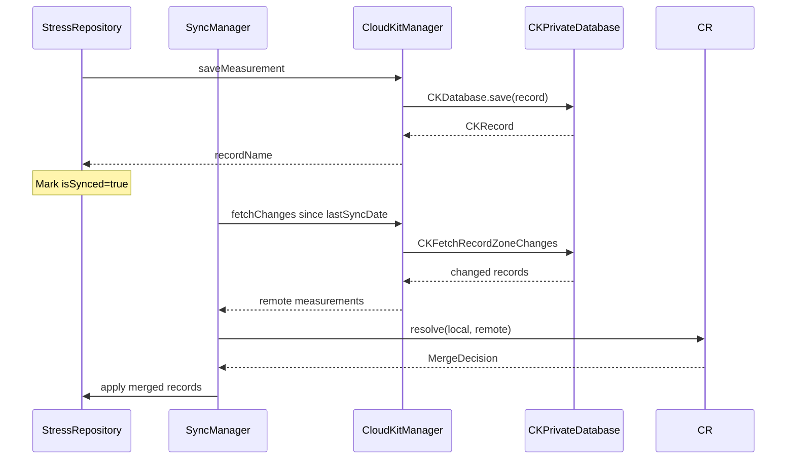

# CloudKit sync

Optional end-to-end encrypted sync of stress measurements across the user's devices. Uses the CloudKit private database so records are not visible to anyone but the account owner. The repository layer triggers sync after every local save; a separate `SyncManager` reconciles deltas and resolves conflicts.

## Key abstractions

| Type | File | Description |
| --- | --- | --- |
| `CloudKitServiceProtocol` | `StressMonitor/StressMonitor/Services/Protocols/CloudKitServiceProtocol.swift` | Interface for sync status, save, fetch, subscription management. |
| `CloudKitManager` | `StressMonitor/StressMonitor/Services/CloudKit/CloudKitManager.swift` | Production implementation. Wraps `CKContainer.default().privateDatabase`. |
| `CloudKitSchema` | `StressMonitor/StressMonitor/Services/CloudKit/CloudKitSchema.swift` | Record type and field name constants. |
| `CloudKitSyncEngine` | `StressMonitor/StressMonitor/Services/CloudKit/CloudKitSyncEngine.swift` | Push/pull cycle orchestration. |
| `SyncManager` | `StressMonitor/StressMonitor/Services/Sync/SyncManager.swift` | High-level coordinator invoked by the repository. |
| `ConflictResolver` | `StressMonitor/StressMonitor/Services/Sync/ConflictResolver.swift` | Merge strategies for divergent local/remote records. |

## Record schema

Defined in `CloudKitSchema.swift`. Each `StressMeasurement` becomes a `CKRecord` of type `StressMeasurement` with these fields:

- `timestamp`, `stressLevel`, `hrv`, `restingHeartRate`, `category`
- `confidences` (array of doubles)
- `deviceID` (originating device)
- `isDeleted` (soft-delete tombstone)
- `cloudKitModTime` (last modification time, used for conflict resolution)

## Sync flow

## Conflict resolution

`ConflictResolver` supports four strategies:

| Strategy | Behavior |
| --- | --- |
| `.timestamp` (default) | Last-writer-wins by `cloudKitModTime`. Ties broken by device priority. |
| `.devicePriority` | iPhone beats iPad beats Watch. Used when timestamps are within a small window. |
| `.server` | Always keep the remote record. |
| `.client` | Always keep the local record. |

The resolver returns a `MergeDecision` (`.keepLocal`, `.keepRemote`, or `.merge(local:remote:)`) that `SyncManager` applies to the local SwiftData store.

## Device ID

Each device generates a UUID at first launch and stores it in `UserDefaults` under `com.stressmonitor.deviceID`. The ID is attached to every `StressMeasurement` so the conflict resolver can detect cross-device edits and the dashboard can show "recorded on Apple Watch" vs "recorded on iPhone".

## Soft deletes

Deletion is a soft-delete: the `isDeleted` flag is set to `true` on the CKRecord rather than removing it. This lets deletions propagate to other devices through the change feed without losing audit history. A separate cleanup pass (see [Data management](data-management.md)) performs hard deletes when the user requests data wipe.

## Entry points for modification

- **Add a new field to sync**: add it to `CloudKitSchema`, map it in `CloudKitManager.saveMeasurement` and the fetch path, and include it in the `ConflictResolver` merge logic if it needs per-field resolution.
- **Change conflict strategy**: construct `ConflictResolver(strategy: .server)` and inject it into `SyncManager`.
- **Add a new record type**: declare the record type in `CloudKitSchema`, add save/fetch methods to `CloudKitManager`, and register a subscription in `CloudKitSyncEngine`.
