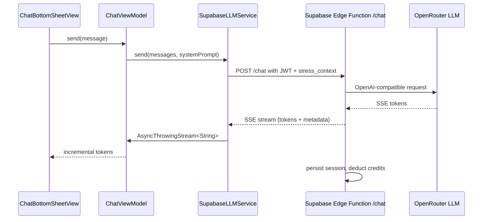

# LLM chat

The AI coaching chat. Streams responses from a Supabase Edge Function (`/chat`) over Server-Sent Events. The backend constructs the system prompt from a stress-context payload, selects the LLM model with a fallback chain, deducts credits, and persists the session. The app parses the SSE stream and surfaces tokens incrementally in `ChatBottomSheetView`.

## Key abstractions

| Type | File | Description |
| --- | --- | --- |
| `LLMServiceProtocol` | `StressMonitor/StressMonitor/Services/LLM/LLMServiceProtocol.swift` | Interface: `isAvailable()`, `send(messages:systemPrompt:)` returning `AsyncThrowingStream<String, Error>`. |
| `SupabaseLLMService` | `StressMonitor/StressMonitor/Services/LLM/SupabaseLLMService.swift` | Production implementation. Talks to the Supabase Edge Function. |
| `SupabaseConfig` | `StressMonitor/StressMonitor/Services/LLM/SupabaseConfig.swift` | Resolves URL, anon key, guest JWT, and Edge Function endpoints from Info.plist / env / UserDefaults. |
| `SupabaseSecrets` | `StressMonitor/StressMonitor/Services/LLM/SupabaseSecrets.swift` | Gitignored secrets (guest JWT fallback). |
| `SSEParser` | `StressMonitor/StressMonitor/Services/LLM/SSEParser.swift` | Parses individual SSE lines into `.content`, `.metadata`, `.done`, or `.error`. |
| `ChatContextBuilder` | `StressMonitor/StressMonitor/Services/LLM/ChatContextBuilder.swift` | Builds the `StressContextPayload` from current measurements. |
| `StressContextPayload` | `StressMonitor/StressMonitor/Services/LLM/StressContextPayload.swift` | Codable struct sent to the backend so it can construct the system prompt. |
| `ChatQuickActions` | `StressMonitor/StressMonitor/Services/LLM/ChatQuickActions.swift` | Canned suggestion chips above the chat input. |
| `KeychainService` | `StressMonitor/StressMonitor/Services/KeychainService.swift` | Stores the Supabase access token in the iOS Keychain. |

## Request flow

The app is stateless about the system prompt. `ChatViewModel` passes a `StressContextPayload` (current stress level, category, recent HRV/HR trend, factor breakdown) and the backend builds the prompt from it. This keeps health-context summarization server-side and avoids leaking raw HealthKit samples.

## Authentication

The service expects a Supabase JWT. The current implementation falls back to a guest JWT from `SupabaseSecrets` for testing, but production use requires Apple Sign-In (the TODO in `SupabaseConfig.swift` calls this out). The token is stored in the iOS Keychain under `com.stressmonitor.app` / `supabaseAccessToken` and refreshed through `setAccessToken(_:)`.

## SSE parsing

`SSEParser.parse(line:)` handles three shapes in the stream:

1. `data: {"choices":[{"delta":{"content":"..."}}]}` - OpenAI-compatible content token.
2. `data: {"type":"metadata","session_id":"...","credits_remaining":N,"model_used":"..."}` - backend metadata emitted at the end of the stream.
3. `data: [DONE]` - stream sentinel.

The parser is `nonisolated` and side-effect-free so it can run on any actor. The service applies metadata (`sessionId`, `creditsRemaining`, `modelUsed`) to its own state when the parser returns `.metadata`.

## Error mapping

HTTP status codes from the Edge Function are mapped to `LLMServiceError` cases:

| Status | Error |
| --- | --- |
| 401 | `unavailable(reason: "Please sign in to use AI Chat.")` |
| 402 | `unavailable(reason: "Out of credits...")` |
| 429 | `.rateLimited` |
| 422 | `unavailable(reason: "Bad request body")` |
| 502 | `unavailable(reason: "Provider failure")` |

## Configuration resolution

`SupabaseConfig.configuredString(...)` resolves each value in priority order:

1. Info.plist key (set via Xcode build settings)
2. Process environment variable (for tests)
3. UserDefaults key (for local QA overrides)
4. Hardcoded fallback (project URL only; the anon key falls back to a masked placeholder)

`SupabaseConfig.isConfigured` returns true only when the anon key is non-empty, which gates `SupabaseLLMService.isAvailable()`.

## Entry points for modification

- **Swap LLM providers**: the backend owns model selection. The app only needs to handle the SSE shape the backend emits. If a new provider returns a different token format, extend `SSEParser.parse`.
- **Add a new Edge Function endpoint**: declare the URL in `SupabaseConfig` and add a service method mirroring `send`.
- **Replace guest JWT with real auth**: implement `SupabaseAuthService` (Apple Sign-In), call `setAccessToken` after sign-in, and remove the guest JWT fallback.
