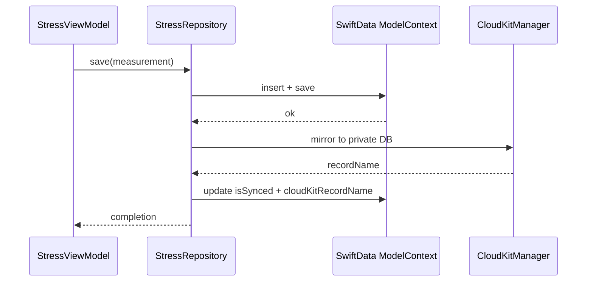

# Persistence

StressMonitor stores all measurements locally in SwiftData. CloudKit mirrors records to the user's private database for cross-device sync (see [CloudKit sync](cloudkit-sync.md)). The repository layer (`StressRepository`) is the single write path.

## Key abstractions

| Type | File | Description |
| --- | --- | --- |
| `StressRepository` | `StressMonitor/StressMonitor/Services/Repository/StressRepository.swift` | Single persistence facade. Saves measurements, fetches history, computes baseline. |
| `StressRepositoryProtocol` | `StressMonitor/StressMonitor/Services/Protocols/StressRepositoryProtocol.swift` | Interface for test substitution. |
| `StressMeasurement` | `StressMonitor/StressMonitor/Models/StressMeasurement.swift` | Central `@Model` class. |
| `CharacterUnlock` | `StressMonitor/StressMonitor/Models/Character/CharacterUnlock.swift` | `@Model` for character unlock state and evolution progress. |
| `Habit` | `StressMonitor/StressMonitor/Models/Habit.swift` | `@Model` added in schema V2. Habit tracking for the Action tab. |

## StressMeasurement fields

The central record. Composite stress level, raw biometrics, per-factor component values (added in the multi-factor migration), and CloudKit sync metadata.

| Field | Type | Purpose |
| --- | --- | --- |
| `timestamp` | `Date` | When the measurement was taken |
| `stressLevel` | `Double` | Composite 0-100 score |
| `hrv` | `Double` | Raw HRV (SDNN, ms) |
| `restingHeartRate` | `Double` | Resting heart rate |
| `categoryRawValue` | `String` | Persisted `StressCategory` raw value |
| `confidences` | `[Double]?` | Optional per-factor confidences |
| `hrvComponent` | `Double?` | HRV factor's 0-1 contribution |
| `hrComponent` | `Double?` | HR factor's 0-1 contribution |
| `sleepComponent` | `Double?` | Sleep factor's 0-1 contribution |
| `activityComponent` | `Double?` | Activity factor's 0-1 contribution |
| `recoveryComponent` | `Double?` | Recovery factor's 0-1 contribution |
| `dataCompleteness` | `Double?` | 0-1 data completeness ratio |
| `isSynced` | `Bool` | Whether CloudKit mirror has confirmed |
| `cloudKitRecordName` | `String?` | CKRecord record name |
| `deviceID` | `String` | Originating device identifier |
| `cloudKitModTime` | `Date?` | Last modification time for conflict resolution |

The computed `category` accessor derives a `StressCategory` from `categoryRawValue` so the enum never needs to be persisted directly.

## Schema versioning

SwiftData migrations are declared explicitly in `StressMonitor/StressMonitor/StressMonitorApp.swift`:

- `AppSchemaV1` - ships `StressMeasurement` and `CharacterUnlock`.
- `AppSchemaV2` - adds `Habit`.
- `AppMigrationPlan` registers a `MigrationStage.lightweight` from V1 to V2.

This explicit plan exists because iOS 17.0 through 17.3 could silently wipe the on-disk store when the model set changed without a migration plan. Declaring the stage forces an in-place migration instead.

## Personal baseline

`PersonalBaseline` is persisted to `UserDefaults` under `com.stressmonitor.personalBaseline` (encoded as JSON). It carries the rolling HRV baseline, hourly HRV baseline dictionary for circadian adjustment, resting heart rate, and optional calibrated `FactorWeights`. `StressRepository.getBaseline()` returns a cached copy or recomputes one from history via `BaselineCalculator`.

## Repository flow

`StressRepository.save` always writes locally first (offline-first), then triggers an async CloudKit mirror. If the CloudKit call fails, the record stays local with `isSynced = false` and a later sync cycle picks it up.

## Entry points for modification

- **Add a new persisted field on StressMeasurement**: add the property (optionally optional for a lightweight migration), include it in the CloudKit record mapping in `CloudKitManager.saveMeasurement`, and surface it in `DataExporter` outputs.
- **Add a new @Model**: add it to `AppSchemaV2.models` (or declare a V3 with a migration stage), then add it to the schema in `StressMonitorApp.swift`.
- **Change the baseline algorithm**: edit `BaselineCalculator` at `StressMonitor/StressMonitor/Services/Algorithm/BaselineCalculator.swift`. The repository caches the result; clear `cachedBaseline` when inputs change.
