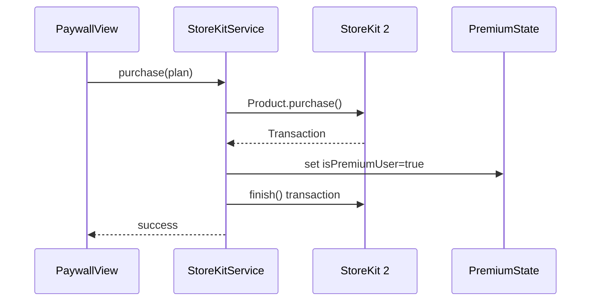

# StoreKit IAP

StoreKit 2 subscription handling for the premium tier. Three billing periods (weekly, monthly, annual) with product IDs resolved at runtime from build configuration. `PaywallController` is the single presentation entry point for the paywall from anywhere in the app.

## Key abstractions

| Type | File | Description |
| --- | --- | --- |
| `StoreKitServiceProtocol` | `StressMonitor/StressMonitor/Services/StoreKit/StoreKitServiceProtocol.swift` | Interface: `availablePlans`, `isPremiumUser`, `purchase(_:)`, `restorePurchases()`. |
| `StoreKitService` | `StressMonitor/StressMonitor/Services/StoreKit/StoreKitService.swift` | Production implementation. Listens for transaction updates, refreshes entitlements. |
| `StoreKitProductCatalog` | `StressMonitor/StressMonitor/Services/StoreKit/StoreKitProductCatalog.swift` | Resolves product IDs from Info.plist, env, or UserDefaults. `.live` for production. |
| `PremiumState` | `StressMonitor/StressMonitor/Services/StoreKit/PremiumState.swift` | Observable singleton tracking `isPremiumUser`. Consulted by the paywall and feature gates. |
| `MockStoreKitService` | `StressMonitor/StressMonitor/Services/StoreKit/MockStoreKitService.swift` | Preview/test mock with canned plans. |
| `SubscriptionPlan` | `StressMonitor/StressMonitor/Models/SubscriptionPlan.swift` | Display model: price, period, savings, billing summary. |
| `PaywallController` | `StressMonitor/StressMonitor/Services/Premium/PaywallController.swift` | App-root singleton for full-screen paywall presentation. |

## Product ID resolution

`StoreKitProductCatalog` resolves each product ID in priority order, mirroring `SupabaseConfig`:

1. Info.plist key (set via Xcode build settings): `STOREKIT_PREMIUM_WEEKLY_PRODUCT_ID`, `STOREKIT_PREMIUM_MONTHLY_PRODUCT_ID`, `STOREKIT_PREMIUM_ANNUAL_PRODUCT_ID`.
2. Process environment variable (same keys, useful for CI and tests).
3. UserDefaults key (`storeKitPremiumWeeklyProductID`, etc.).

Empty strings and unresolved build-setting placeholders like `$(STOREKIT_PREMIUM_MONTHLY_PRODUCT_ID)` are treated as `nil`. If no product IDs resolve, `availablePlans` returns `SubscriptionPlan.defaultPlans` (hardcoded display-only plans), and purchase attempts fail with `StoreKitError.missingProductConfiguration`.

## Purchase flow



`StoreKitService` listens for transaction updates in the background through `Transaction.updates`, so purchases made outside the app (family sharing, win-back offers) are picked up and reflected in `PremiumState`.

## Paywall presentation

`PaywallController` is mounted once at the app root in `StressMonitorApp`. Any view can present the paywall by reading it from the environment:

```swift
@Environment(PaywallController.self) private var paywall
paywall.present(reason: .trendsLongRange)
```

`present(_:)` is a no-op when the user already has premium, so feature gates can call it unconditionally without checking entitlement. The `PaywallReason` enum (`.general`, `.trendsLongRange`, `.bioAgeDetail`, `.characters`, `.breathingAdvanced`, `.feature(named:)`) drives analytics and header copy.

## Default plans

When StoreKit cannot resolve products, `SubscriptionPlan.defaultPlans` provides three fallback display plans so the paywall renders something useful in previews and development:

| Period | Monthly equiv | Period price | Savings |
| --- | --- | --- | --- |
| Annual | $4.99/mo | $59.88 | 37% (best value) |
| Monthly | $7.99/mo | $7.99 | - |
| Weekly | $12.95/mo equiv | $2.99/wk | - |

## Entry points for modification

- **Add a new product tier**: add the product ID key to `StoreKitProductCatalog`, add a case to `SubscriptionPeriod`, and map it in `SubscriptionPlan.defaultPlans`.
- **Change the paywall trigger for a feature**: call `paywall.present(reason:)` with a new `PaywallReason` case from the gating view.
- **Test purchases locally**: use a StoreKit Configuration File in Xcode and pass a `MockStoreKitService` or `StoreKitProductCatalog` with hardcoded IDs in tests.
