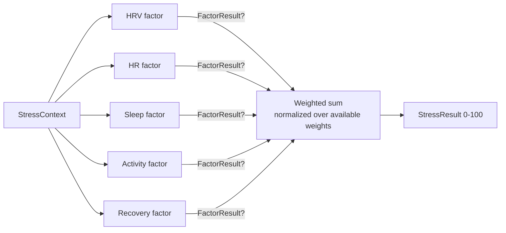

# Stress algorithm

The core domain. Produces a 0-100 stress score from five HealthKit signals, binned into five categories that drive color, icon, character mood, and recommendations throughout the app.

## Key abstractions

| Type | File | Description |
| --- | --- | --- |
| `StressAlgorithmServiceProtocol` | `StressMonitor/StressMonitor/Services/Protocols/StressAlgorithmServiceProtocol.swift` | Entry point. Three methods: 2-factor `calculateStress`, `calculateConfidence`, and `calculateMultiFactorStress(context:)`. |
| `MultiFactorStressCalculator` | `StressMonitor/StressMonitor/Services/Algorithm/MultiFactorStressCalculator.swift` | Primary implementation. Iterates registered `StressFactor`s, normalizes weights, returns composite `StressResult`. |
| `StressCalculator` | `StressMonitor/StressMonitor/Services/Algorithm/StressCalculator.swift` | Legacy fallback. 70% HRV + 30% HR sigmoid blend. Used when a context has only HRV and HR. |
| `StressFactor` (protocol) | `StressMonitor/StressMonitor/Services/Algorithm/StressFactor.swift` | One factor. Returns optional `FactorResult` (nil when its input is missing). |
| `StressContext` | `StressMonitor/StressMonitor/Models/StressContext.swift` | Carries baseline plus optional raw inputs to the calculator. |
| `StressResult` | `StressMonitor/StressMonitor/Models/StressResult.swift` | Output: level (0-100), category, confidence, raw values, optional `FactorBreakdown`. |
| `FactorBreakdown` | `StressMonitor/StressMonitor/Models/FactorBreakdown.swift` | Per-factor component values and `dataCompleteness`. Powers the dashboard "stress sources" card. |
| `BaselineCalculator` | `StressMonitor/StressMonitor/Services/Algorithm/BaselineCalculator.swift` | Rolling HRV baseline with hourly circadian adjustment. |
| `FactorCalibrator` | `StressMonitor/StressMonitor/Services/Algorithm/FactorCalibrator.swift` | Adjusts factor weights from user history. |
| `BioAgeCalculator` | `StressMonitor/StressMonitor/Services/Algorithm/BioAgeCalculator.swift` | Estimates biological age from HRV/HR/recovery vs age-expected baselines. Premium feature. |

## Five factors

| Factor | File | Default weight | Input |
| --- | --- | --- | --- |
| `HRVStressFactor` | `StressMonitor/StressMonitor/Services/Algorithm/HRVStressFactor.swift` | 0.40 | `context.hrv` (SDNN, ms) |
| `HeartRateStressFactor` | `StressMonitor/StressMonitor/Services/Algorithm/HeartRateStressFactor.swift` | 0.25 | `context.heartRate` vs resting baseline |
| `SleepStressFactor` | `StressMonitor/StressMonitor/Services/Algorithm/SleepStressFactor.swift` | 0.15 | `context.sleepData` duration/quality |
| `ActivityStressFactor` | `StressMonitor/StressMonitor/Services/Algorithm/ActivityStressFactor.swift` | 0.10 | `context.activityData` steps/active energy |
| `RecoveryStressFactor` | `StressMonitor/StressMonitor/Services/Algorithm/RecoveryStressFactor.swift` | 0.10 | `context.recoveryData` resting HR / HRV trend |

Each factor returns `nil` when its input is missing. The calculator redistributes the missing factor's weight across the remaining available factors, so a context with only HRV and HR degrades gracefully to a two-factor score.

## How the score is computed



1. `MultiFactorStressCalculator.calculateMultiFactorStress(context:)` calls each factor's `calculate(context:)`.
2. Each factor normalizes its raw input against the personal baseline using a sigmoid curve, returning a 0-1 score plus a per-factor confidence.
3. The composite is the weighted sum of factor values, where the divisor is the sum of available factor weights (not the total possible), so missing factors do not drag the score down.
4. Confidence blends data completeness (40% weight) with average per-factor confidence (60%).
5. `StressResult.category` bins the 0-100 level into `relaxed` (0-25), `mild` (25-50), `moderate` (50-75), `high` (75-90), or `severe` (90-100).

## Factor implementation pattern

Each factor follows the same shape: guard the input, extract baseline values into locals before crossing actor boundaries, normalize, clamp, run a sigmoid, and compute a confidence penalty for low-quality inputs.

```swift
struct HRVStressFactor: StressFactor {
    let id = "hrv"
    let weight = 0.40

    func calculate(context: StressContext) async throws -> FactorResult? {
        guard let hrv = context.hrv else { return nil }
        // ... circadian baseline adjustment, sigmoid normalization
        return FactorResult(value: value, confidence: confidence, metadata: [...])
    }
}
```

## Fallback calculator

`StressCalculator` is the legacy two-factor path used by `calculateStress(hrv:heartRate:)` (when only HRV and HR are available) and as the inner engine inside `MultiFactorStressCalculator` for that same code path. It blends a sigmoid-normalized HRV component (70%) with a sigmoid-normalized HR component (30%).

## SDNN note

Apple HealthKit exposes SDNN-based HRV (`.heartRateVariabilitySDNN`), not RMSSD. SDNN runs slightly higher than RMSSD but remains a reliable relative stress indicator when normalized against a personal baseline. The baseline normalization in `StressCalculator.normalizeHRV` and `HRVStressFactor.calculate` compensates for the SDNN/RMSSD difference at the individual level.

## Entry points for modification

- **Add a new factor**: create a `StressFactor`-conforming struct, add it to the `factors` array in `MultiFactorStressCalculator.init`, and add a case to `FactorBreakdown` if you want it surfaced in the UI.
- **Tune factor weights**: edit the `weight` constant on each factor, or supply a calibrated `FactorWeights` through `PersonalBaseline.factorWeights` to override defaults per user.
- **Change category thresholds**: edit `StressResult.category(for:)` in `StressMonitor/StressMonitor/Models/StressResult.swift`. The `StressCategory.color` and `.icon` mapping in `StressCategory.swift` must also be updated for consistency.
